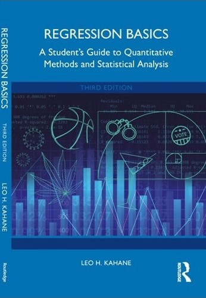
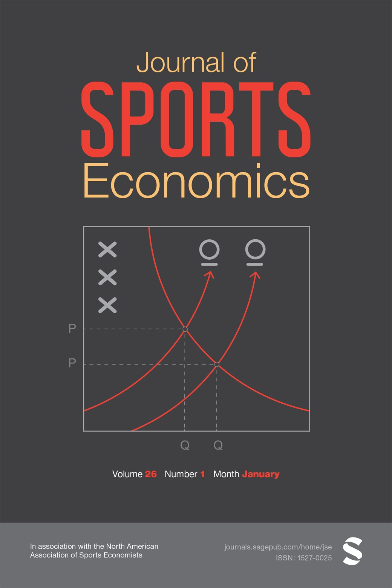

## **Welcome to my webpage!**

---

### I am the *Michael A. Ruane Distinguished Chair in Economics* at Providence College.

Here you can find my [CV](vita_Fall_2024.pdf)

---
### New edition of my book [*Regression Basics*](https://www.routledge.com/9781032393186)

Using an accessible, nontechnical approach, the third edition of Regression Basics introduces readers to the fundamentals of statistical regression. Accessible to anyone with an introductory statistics background, the book draws on engaging examples using real-world data and software programs SPSS®, Stata®, and R to illustrate the key concepts of the least squares regression methodology.

The book emphasizes the intuition of regression methodology and provides a hands-on approach, as well as helpful end-of-chapter summaries and questions to consolidate learning. This new edition has been substantially revised and enhanced, with features including the following:

* Fully updated to show procedures in **R, SPSS®, and Stata®**

* Color images and substantially revised visual presentation

* A suite of online resources including data sets, software instructions, and PowerPoint slides for instructors

* New and updated examples throughout

* Expanded material to help students overcome "math anxiety"
  
* Expanded material on multicollinearity, heteroskedasticity, and robust standard errors

This well-paced book is ideal for advanced undergraduate and graduate students focusing on quantitative methods, research design, and statistical regression in the social and behavioral sciences, political science, and economics.

---

### I am the founding editor of the [*Journal of Sports Economics*](https://journals.sagepub.com/home/jse) and served as the editor-in-chief for 16 years.

